# Deploying Django Applications on cPanel (Shared Hosting)

# Index
- [Before Start](#-before-start)
- [Step-01: Prepare Django Project](#-step-01-prepare-django-project)
- [Step-02: Logging Into the Cpanel](#-step-02-logged-in-into-the-cpanel-dashboard)
- [Step-03: Create Subdomain](#-step-03--create-sub-domain-if-needed)
- [Step-04: Setup Application](#-step-04--setup-application)
- [Step-05: Setup MySQL Database](#-step-05--setup-mysql-database-if-you-want)
- [Step-06: Upload Project Files](#-step-06--upload-project-files)
- [Step-07: Final Setup](#-step-07--final-setup)
    - [If You Have Terminal Access](#if-you-have-terminal)
    - [If You Don't Have Terminal Access](#if-you-dont-have-terminal-access)

# ✅ Before Start

- Building a Django application on your computer is only half the journey. The real magic happens when you share it with the world.     While enterprise apps often use complex cloud infrastructure, cPanel shared hosting offers an affordable, accessible, and highly visual way to bridge the gap between `localhost` and a live production server. By the end of this guide, you won't just have a working app - you will have the practical deployment skills needed to build your professional portfolio.

- ### 🚀 Deployment Workflow: How Code Reaches the Server

Depending on your infrastructure, the way you actually push updates to your live Django application changes drastically:

* **Shared Hosting (The Beginner Way):** Manual and visual. You will often ZIP your files, upload them via the cPanel File Manager (or FTP), extract them, and click a button to restart the Python app. Simple, but tedious for frequent updates.
* **VPS / Cloud (The Developer Way):** Terminal-based. You will connect via SSH, run `git pull` to fetch your latest code from GitHub, manually run `python manage.py migrate`, and restart Gunicorn/Nginx using command-line tools like `systemctl`.
* **Enterprise / Kubernetes / Azure (The DevOps Way):** Fully automated. You simply push your code to GitHub's `main` branch. A CI/CD pipeline (like GitHub Actions) automatically tests the code, builds a Docker image, and rolls it out to the servers with zero downtime. You rarely touch the server yourself.

- A quick comparison matrix to help you choose the right hosting environment based on security, control, and project scale.

| Feature | Shared Hosting (cPanel) | VPS / Cloud (AWS, DigitalOcean) | Enterprise (Kubernetes/Docker) |
| :--- | :--- | :--- | :--- |
| **Data Isolation** | Low (Shared with strangers) | High (Dedicated virtual space) | Maximum (Micro-level isolation) |
| **Root Access** | No | Yes (Total control) | Yes (Infrastructure as Code) |
| **Firewall Control**| Basic (Provider controlled) | Advanced (Custom rules) | Ultimate (Internal network rules) |
| **Best For** | Students, Portfolios, Blogs | SaaS Apps, E-commerce | Banks, Healthcare, Large Tech |

📒[Go To Index](#index)

# ✅ Step-01: Prepare Django Project
- ### 🛠️ The Configuration Effort: Pre-built vs. Blank Slate

The biggest difference you will notice when moving from Shared Hosting to a VPS is the amount of manual configuration required before your app even goes live. 

* **Shared Hosting (cPanel - "Plug and Play"):** 
  Everything is managed and pre-configured by the hosting provider. The operating system, database servers, and web servers (like Apache or LiteSpeed) are already set up. For Django, tools like *Phusion Passenger* are usually pre-installed to bridge Python with the web server. You simply upload your code, create a virtual environment via the cPanel UI, and you are good to go.

* **Cloud VPS ("The Blank Slate"):** 
  When you rent a VPS (like an AWS EC2 instance or a DigitalOcean Droplet), you are given a completely empty Linux operating system (Ex: Ubuntu). **You have to build the entire infrastructure manually.** 
  This means you must personally install, configure, and connect:
  * **Gunicorn:** The WSGI HTTP server to translate Python code so the web can understand it.
  * **Nginx:** The reverse proxy web server to handle incoming traffic, serve static/media files, and pass requests to Gunicorn.
  * System-level firewalls (UFW), SSL certificates (Certbot), and background processes (`systemd`).

### Before Deploy 

- First, you will need to install two essential packages: Gunicorn (Green Unicorn) and Whitenoise. Whitenoise is a lifesaver for deployment!
    - `!Remember: gunicorn is needed for a VPS (the blank slate). But on cPanel, the hosting provider already uses a built-in software called Phusion Passenger to run your Python code. If anyone try to configure gunicorn on cPanel, it will not work and will cause errors.`
However, Whitenoise is 100% essential because cPanel struggles to serve Django's static files (CSS, JS, images) out of the box. Whitenoise fixes this perfectly.
    - `!In simple terms: Gunicorn and Phusion Passenger essentially do the exact same job. The primary function of both is to act as a bridge between your Python (Django) code and the Web Server (such as Apache or Nginx). In technical terms, this is known as a WSGI Server.`
    - `The only difference is where they are used: cPanel (Shared Hosting): The hosting provider already has Phusion Passenger pre-configured on the server. To run your app, cPanel automatically generates a file called passenger_wsgi.py. Therefore, there is no need to install or configure Gunicorn here. But VPS / Cloud: Since nothing is set up in advance here (it is a Blank Slate), developers must manually install Gunicorn to build this bridge themselves.`

- Gunicorn acts as a production version of runserver - it keeps your app running continuously and handles multiple user requests simultaneously. Whitenoise acts as a lightweight server specifically for your static assets (CSS, JS, images) in a production environment.

- Let's start to make ready the project
- Now setup whitenoise in your project first
    ```sh
    pip install whitenoise
    ```
### 🔹Modify `settings.py`

- Make sure `DEBUG = False` in `settings.py`
- Set `ALLOWED_HOSTS` to your domain or used `*` to accept any domain
    
    ```python
    ALLOWED_HOSTS = ["yourdomain.com"] # you can used multiple domain or subdomain
    
    # or
    ALLOWED_HOSTS = ["*"]
    ```
    
- Integrate`whitenoise`  inside the `INSTALLED_APPS and MIDDLEWARE` in `settings.py`:
    
    ```python
    INSTALLED_APPS = [
        'django.contrib.admin',
        'django.contrib.auth',
        'django.contrib.contenttypes',
        'django.contrib.sessions',
        'django.contrib.messages',
        'whitenoise.runserver_nostatic', # This must be added before 'django.contrib.staticfiles'
        'django.contrib.staticfiles',
        'portfolioapp',
    ]
    ```
    
    ```python
    MIDDLEWARE = [
        'django.middleware.security.SecurityMiddleware',
        'django.contrib.sessions.middleware.SessionMiddleware',
        'whitenoise.middleware.WhiteNoiseMiddleware', # This must be added here after SecurityMiddleware & SessionMiddleware
        'django.middleware.common.CommonMiddleware',
        'django.middleware.csrf.CsrfViewMiddleware',
        'django.contrib.auth.middleware.AuthenticationMiddleware',
        'django.contrib.messages.middleware.MessageMiddleware',
        'django.middleware.clickjacking.XFrameOptionsMiddleware',
    ]
    ```
    
- Set `Static & Media Files` root in `settings.py`
    
    ```python
    STATIC_URL = 'static/'
    MEDIA_URL = '/media/'
    STATIC_ROOT = BASE_DIR / 'staticfiles/'
    MEDIA_ROOT = BASE_DIR / 'media/'
    STATICFILES_STORAGE = 'whitenoise.storage.CompressedStaticFilesStorage'
    ```
    
- Final Overview of the `settings.py`
    
    ```python
    DEBUG = False
    ALLOWED_HOSTS = ["yourdomain.com"]
    
    INSTALLED_APPS = [
        'django.contrib.admin',
        'django.contrib.auth',
        'django.contrib.contenttypes',
        'django.contrib.sessions',
        'django.contrib.messages',
        'whitenoise.runserver_nostatic', # This must be added before 'django.contrib.staticfiles'
        'django.contrib.staticfiles',
        'portfolioapp',
    ]
    
    MIDDLEWARE = [
        'django.middleware.security.SecurityMiddleware',
        'django.contrib.sessions.middleware.SessionMiddleware',
        'whitenoise.middleware.WhiteNoiseMiddleware', # This must be added here after SecurityMiddleware & SessionMiddleware
        'django.middleware.common.CommonMiddleware',
        'django.middleware.csrf.CsrfViewMiddleware',
        'django.contrib.auth.middleware.AuthenticationMiddleware',
        'django.contrib.messages.middleware.MessageMiddleware',
        'django.middleware.clickjacking.XFrameOptionsMiddleware',
    ]
    
    STATIC_URL = 'static/'
    MEDIA_URL = '/media/'
    STATIC_ROOT = BASE_DIR / 'staticfiles/'
    MEDIA_ROOT = BASE_DIR / 'media/'
    STATICFILES_STORAGE = 'whitenoise.storage.CompressedStaticFilesStorage'
    ```
    

### 🔹Modify `urls.py`

- Modify main project directory `urls.py` file.
    
    ```python
    from django.contrib import admin
    from django.conf import settings
    from django.conf.urls.static import static
    from django.views.static import serve
    from django.urls import path, include, re_path
    
    urlpatterns = [
        path('admin/', admin.site.urls),
        # Other paths...
    ]
    urlpatterns+=re_path(r'^static/(?P<path>.*)$', serve, {'document_root': settings.STATIC_ROOT}),
    urlpatterns+=re_path(r'^media/(?P<path>.*)$', serve, {'document_root': settings.MEDIA_ROOT}),
    ```
    - Note: Including the MEDIA_ROOT routing is strictly for handling dynamic, user-uploaded files. If your project relies only on static assets (like CSS and JS) and has no user file uploads, you do not need to add the media re_path.

### 🔹Prepare `requirements.txt` file

- Add all required the packages and their version that you used in this project. Also must be add `gunicorn, whitenoise` packages for development. Otherwise some time you fetch lots of issue for static and media file after deployment.:
    
    ```python
    Django==6.0.6
    gunicorn==23.0.0
    pillow==10.3.0
    whitenoise==6.9.0
    ```
    For auto create `requirements.txt` used below code:
   ```python
    pip freeze > requirements.txt
   ```
- Finally, Now Delete the Virtual Environment (Like: venv or .venv) folder and Create a zip file.

📒[Go To Index](#index)

# ✅ Step-02: Logged-in into the Cpanel Dashboard

# ✅ Step-03:  Create Sub-Domain (if needed):

- After login search `Domains`
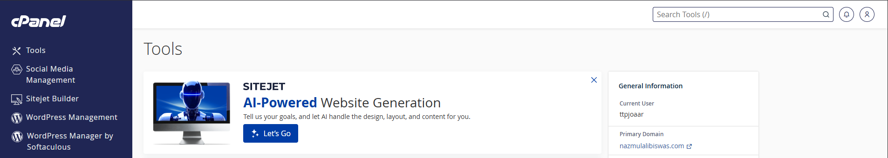
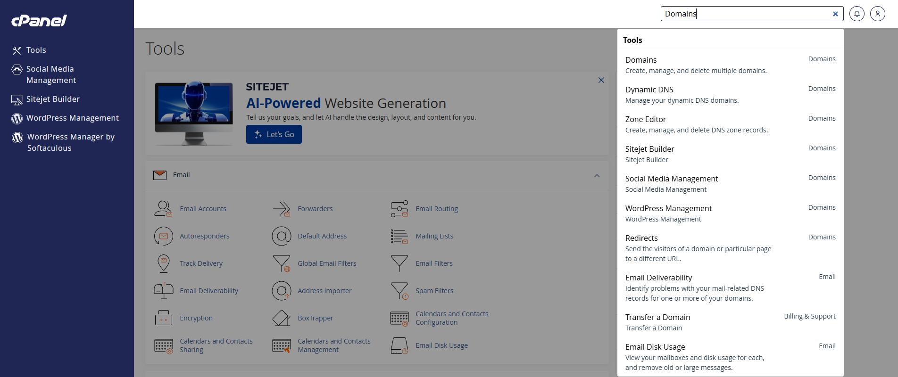
- From the `Domains` Page click to the `Create A New Domain` button.
- Then create and submit

    ```python
    #Ex: test.yourmaindomain.com
    Like this: project.nazmulalibiswas.com
    ```
    - Notes: Don't click on the right mark on the box of 'Share documnent root(/home/theerror/public_html) with "nazmulalibiswas.com"' Ensure the 'Share document root' checkbox remains unchecked. Enabling this option risks conflicting with or accidentally deleting your primary domain's root files.

- Document Root (File System Location)

    ```python
     project.nazmulalibiswas.com #same as a subdomain 
    ```
    - Notes: The document root is the directory on the server that holds your web application's files. Ensure you select the correct folder so the server knows where to load your Django project from.

📒[Go To Index](#index)

# ✅ Step-04:  Setup Application:

- Go to `Setup Python App` page
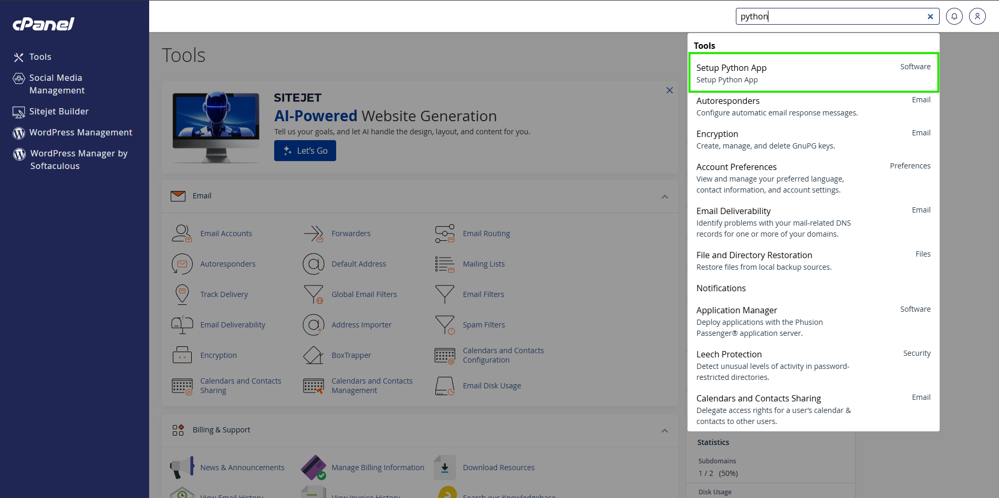
- Click `Create Application` button
- `Python Version:`  Select Python Version
- Notes: Visit here and checkup with matching your python and django version `https://docs.djangoproject.com/en/6.0/faq/install/`
    For example: You using django 6.0 then you have to select (Django 6.0 --> Python 3.12, 3.13, 3.14) any of them.
- `Application root:`  Enter project directory name. Where you upload your project files. (It's should be project realated name for searching & findout very easily)
- `Application URL:` Select the `Domain or Subdomain`
- Then hit the `Create` button.
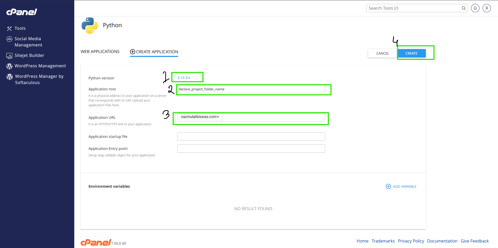

- Notes: Now go to 'File Manager' Here you are see two of folder. 'project_name.nazmulalibiswas.com' this folder is only for static website file. But We are deploying app so the 'Application root' name is searching and upload zip file here. Here already existed some files (like: public, tmp, passenger_wsgi.py & stderr.log) don't delete.

📒[Go To Index](#index)

# ✅ Step-05:  Setup MySQL Database (Optional)

### 🔹Setup Database on the Cpanel

- Go to `Manage My Databases`
- On the Create New Database section set the Database name then hit the `Create Database` button
    
    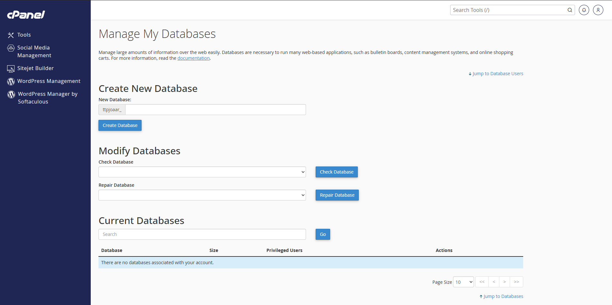
    
- Then scroll down and find `Add New User` section. Here set the database `username, password`
    
    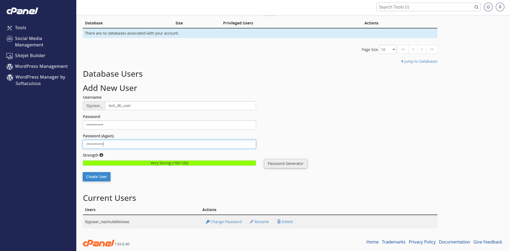
    
- Again scroll down and find `Add User To Database` section. Then select `User and Database`
    
    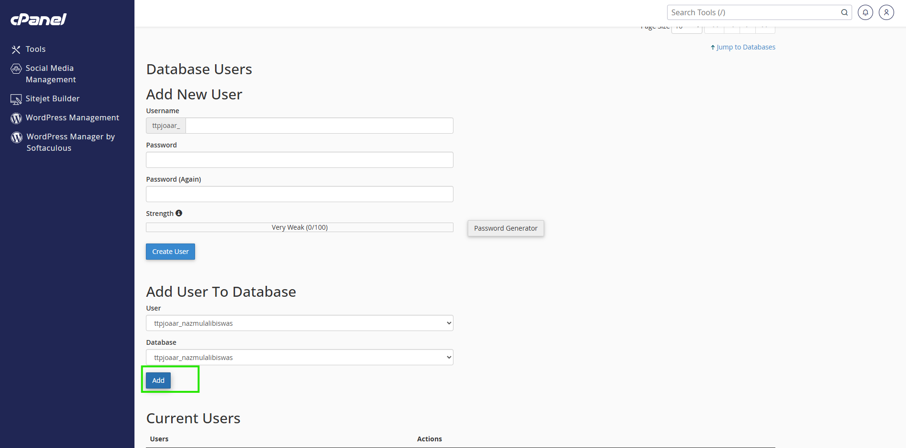
    
- After Add it redirect to the `Manage User Privileges` from here select `ALL PRIVILEGES` then click `Make Changes` button.
    
    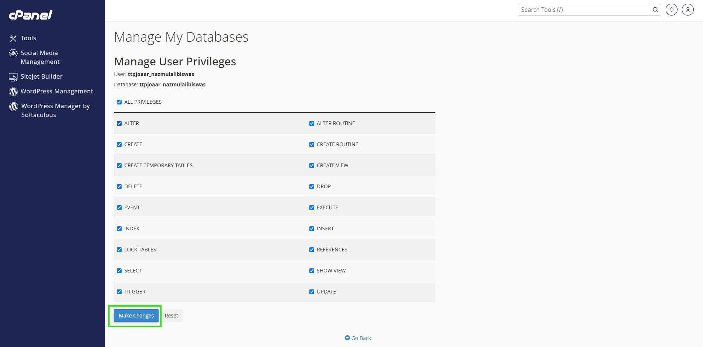
    

`**🚨 Alert:**` Must be copy the Database Name, Username and Password. Because need to configure database on the settings.py

### 🔹Database Configuration

```python
DATABASES = {
    'default': {
        'ENGINE': 'django.db.backends.mysql',
        'NAME': 'your_database_name',
        'USER': 'your_database_username',
        'PASSWORD': 'database_user_password',
        'HOST': 'yourhostdomain.com',
        'PORT': '3306',
    }
}
```

📒[Go To Index](#index)

# ✅ Step-06:  Upload Project Files

- Go to `File Manager` page
- Find the Application root directory.
- Upload the project file as `zip` & Extract here.
- Edit the `passenger_wsgi.py` and add below line and save it.
    
    ```python
    from yourProjectname.wsgi import application
    ```
    
    `**🚨 Note:**` Must change the `yourProjectname` based on your project name where located in wsgi files.

📒[Go To Index](#index)

# ✅ Step-07:  Final Setup

- Go to `Setup Python App` page
- Select your app and click Edit Icon

### 🔹If You Have Terminal:

- Once your files are uploaded, you need to install your project packages and setup the database using the cPanel Terminal. 
    1. Activate the Virtual Environment
    First, go back to your "Python App" setup page and copy the virtual environment activation command (it usually starts with source). Open the Terminal in cPanel, paste the command, and press Enter.

💡 Why do this? This step tells the terminal to use your specific Python version and gives you permission to install packages without hitting server errors.

- 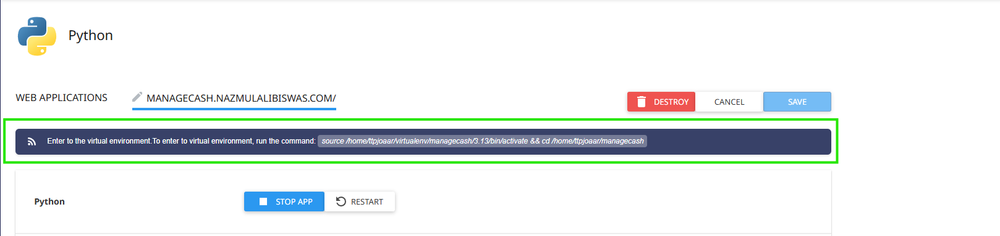
- From the application copy the `virtual environment` command
- Open the Terminal and Paste or press (Ctrl+Shift+V) the command and Press (ENTER)
- (if your want to check all is working good type and press `ls`)
- Then run the below command:
- Install requirements file:
    
    ```bash
    pip install -r requirements.txt
    ```
    
- Migration and Migrate the database:
    
    ```bash
    python manage.py makemigrations
    ```
    
    ```bash
    python manage.py migrate
    ```
    
- Then Apply collect static command to collects all static files from apps and puts them into one central directory for easy serving in production:
    
    ```python
    python manage.py collectstatic
    ```

📒[Go To Index](#index)

### 🔹If You Don’t Have Terminal Access:

- From the Application Setup Page apply the command manually
- Write and Add `requirements.txt` into this section and click `Run Pip Install`. Note: Sometimes it send error message first try. If you fetch error then run again.

    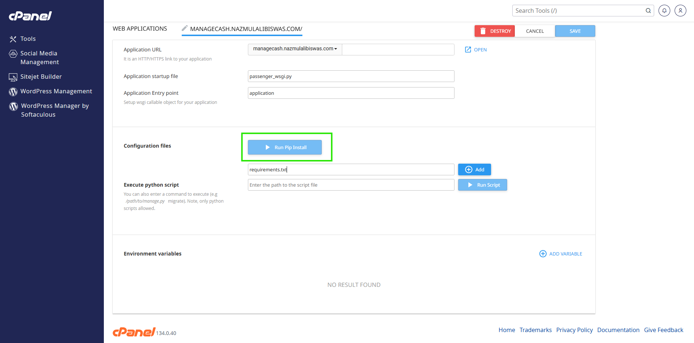

- Then into this section run other command and click `Run Script` button without `py or python`:

    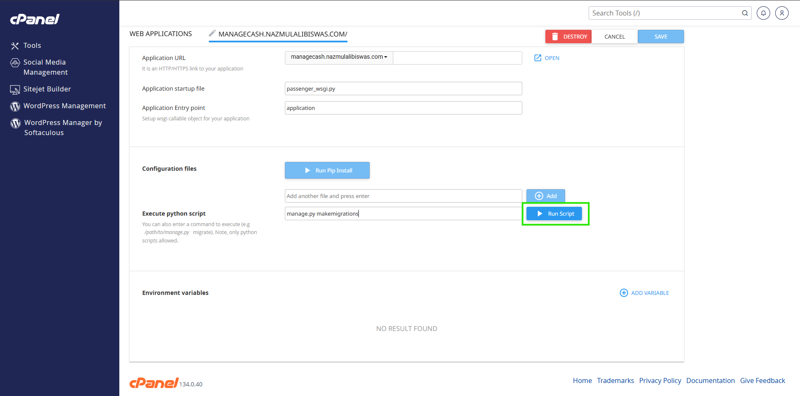

    After that click the `RESTART` button. Now you can visit your application.

## Extra Tips For Cpanel (Permission Denied):
### When this problem is happend in cPanel file or folder are not delete. So Let's fix:
This is a very specific cPanel issue! The error Permission denied when trying to delete files (like views.py, models.py) inside your project folder means that the files don't have the correct write permissions, or they are owned by the root user instead of your cPanel user (ttpjoaar).
Step 1: Fix Permissions so you can delete them, First, we need to force the server to give you permission to read, write, and delete those files. Run this command in your terminal:

```bash
    chmod -R 777 /home/ttpjoaar/path_name/path_name 
    # Example: chmod -R 777 /home/ttpjoaar/CalorieCounter/CalorieCounter
```
- (This command tells the server: "Give full access to everything inside this inner folder." The -R means recursive).

Step 2: Try Deleting Again
Now that you have full permission, run the force delete command again:

```bash
rm -rf /home/ttpjoaar/path_name/path_name
(Example: rm -rf /home/ttpjoaar/CalorieCounter/CalorieCounter)
```

📒[Go To Index](#index)

